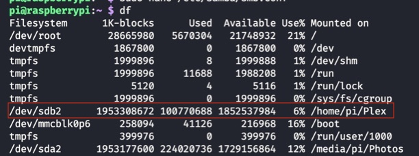
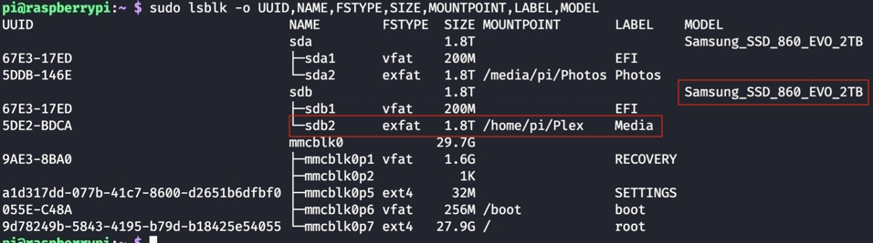

# Raspberrypi setup

- [Add exFat reading capabilities](https://pimylifeup.com/raspberry-pi-exfat/)
- [Add support to samba server](https://pimylifeup.com/raspberry-pi-samba/)

  - Add entry for every single mounted drive

  ```bash
  # smb config
  > sudo apt-get install samba samba-common-bin
  > mkdir /home/pi/shared
  > sudo nano /etc/samba/smb.conf
  # Add config
  > sudo smbpasswd -a pi
  > sudo systemctl restart smbd
  ```

- [Setting AFP](https://pimylifeup.com/raspberry-pi-afp/)
- Plex

  - [Setup Plex for pi4](https://pimylifeup.com/raspberry-pi-plex-server/)
  - [Setup Plex for pi4](https://www.clarkle.com/notes/install-plex-raspberry-pi/)
  - [Setup permission issues 1](https://www.clarkle.com/notes/install-plex-raspberry-pi/)
  - [Setup permission issues 2](https://forums.plex.tv/t/using-ext-ntfs-or-other-format-drives-internal-or-external-on-linux/198544)
  - use `plex user`

  ```bash
  # plex config
  > sudo apt-get install apt-transport-https
  > curl https://downloads.plex.tv/plex-keys/PlexSign.key | sudo apt-key add -
  > echo deb https://downloads.plex.tv/repo/deb public main | sudo tee /etc/apt/sources.list.d/plexmediaserver.list
  > sudo apt-get update
  > sudo apt install plexmediaserver
  > sudo reboot
  ```

> Because Linux is very strict about permissions, being the multi-user system it is, it assumes these unclaimed devices are temporary so mounts them and grants exclusive access to your username only.

> The moment we log in, it asserunmaintanablets this exclusive-lock as it mounts the drives, leaving user **plex** locked out. No amount of permissions values will allow Plex to see the contents.

> To work through this security, we must properly manage the media devices by mounting them in a location where Plex can have access

```bash
# Plex setup
# Identify the disk(s) you want to add in the graphical disk manager
> df

# Once identified the disk name run blkid to extract the information needed
> sudo blkid /dev/sdb2
# /dev/sdb2: LABEL="Media" UUID="5DE2-BDCA" TYPE="exfat" PARTUUID="153700ac-00ef-44d3-9f86-e03d8c0bf744"

# create directory where you'll mount the SSD and change ownership
> mkdir home/pi/Plex
> sudo chown -R plex:plex Plex/media
# Try with pi user

# mount the drive
> sudo mount /dev/sdb2 home/pi/Plex

# create an entry to mount the drive every time the system reboots
> sudo vi /etc/fstab
> /dev/sdb2 /home/pi/Plex exfat defaults 0 0

# add entry to samba config so the drive can be found
> sudo nano /etc/samba/smb.conf

[Plex media]
Comment = Plex media folder
Path = /home/pi/Shared/Plex
Browseable = yes
Writeable = Yes
only guest = no
create mask = 0777
directory mask = 0777
Public = yes
Guest ok = yes
read only = no
valid users = pi

> sudo systemctl restart smbd
> sudo reboot
```

|  |
| :------------: |
|  _df output_   |

|                                             |
| :----------------------------------------------------------: |
|              _df alternative with nicer output_              |
| _sudo lsblk -o UUID,NAME,FSTYPE,SIZE,MOUNTPOINT,LABEL,MODEL_ |

## Static ip

```bash
> sudo nano /etc/dhcpcd.conf

# interface eth0

# static ip_address=192.168.0.10/24
# static routers=192.168.0.1
# static domain_name_servers=192.168.0.1

# interface wlan0

# static ip_address=192.168.0.200/24
# static routers=192.168.0.1
# static domain_name_servers=192.168.0.1

> sudo reboot

```

## ExpressVpn

[Tutorial](https://pimylifeup.com/raspberry-pi-expressvpn/)

### Issues

```bash
# Not connecting to internet

> expressvpn preferences set force_vpn_dns false
> sudo nano /etc/dhcpcd.conf

# change DNS to cloudflare's one
# static domain_name_servers=1.1.1.1
```

## Torrenting

[Tutorial](https://pimylifeup.com/raspberry-pi-transmission/)

## ssh configs

- `ssh-keygen -t rsa` on client

```bash
# ~/.ssh/config on client
Host pi-1
  User pi
  HostName 192.168.50.15
  IdentityFile  ~/.ssh/pi-1
```

- `cat pi-1.pub >> /home/pi/.ssh/authorized_keys` on server
